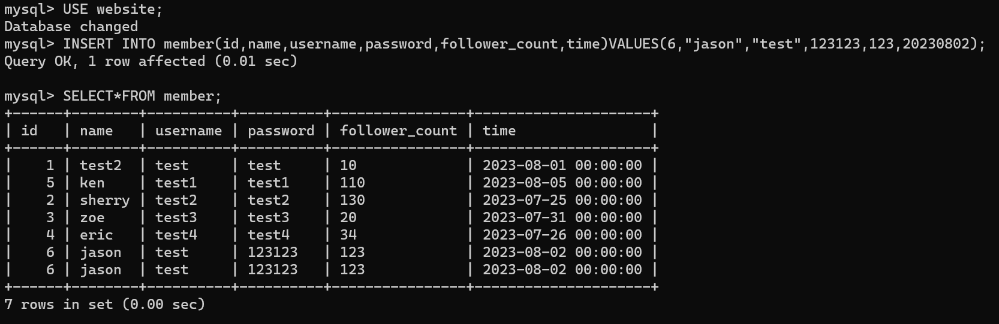
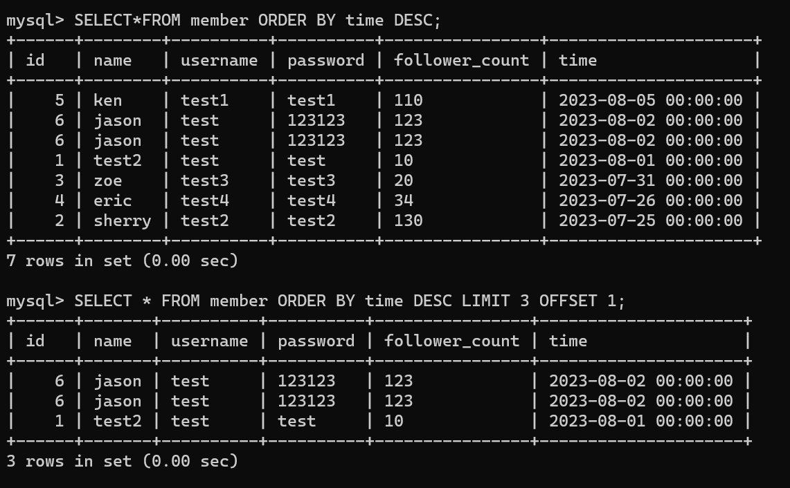
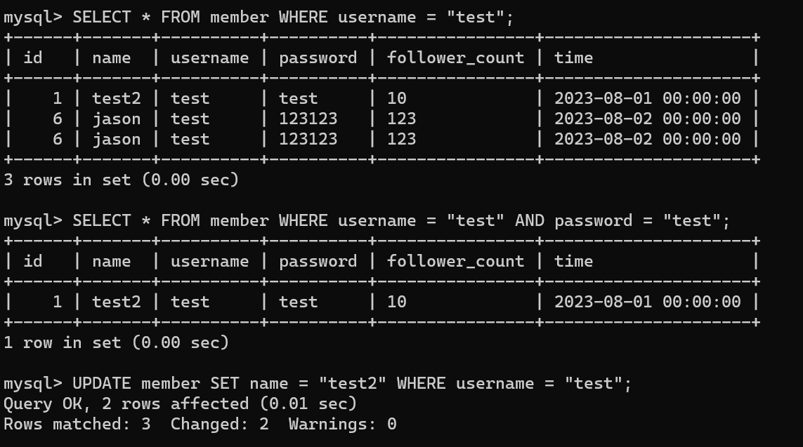
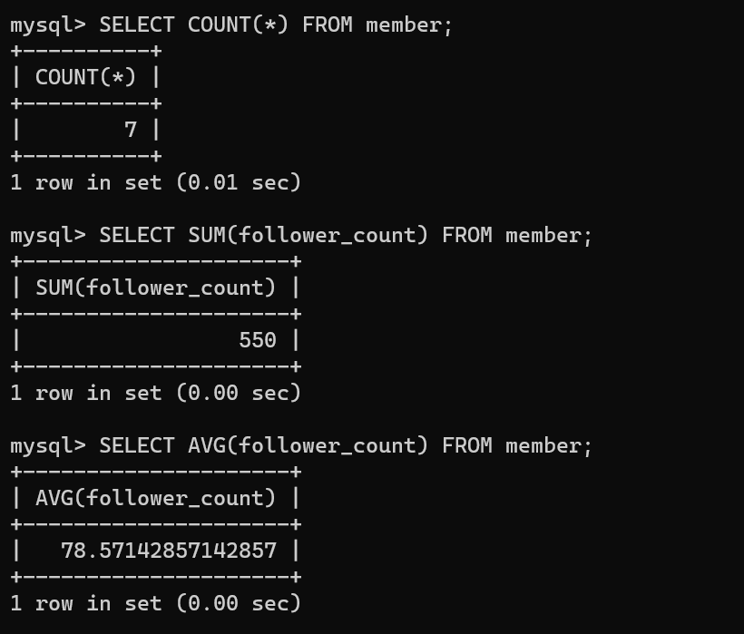
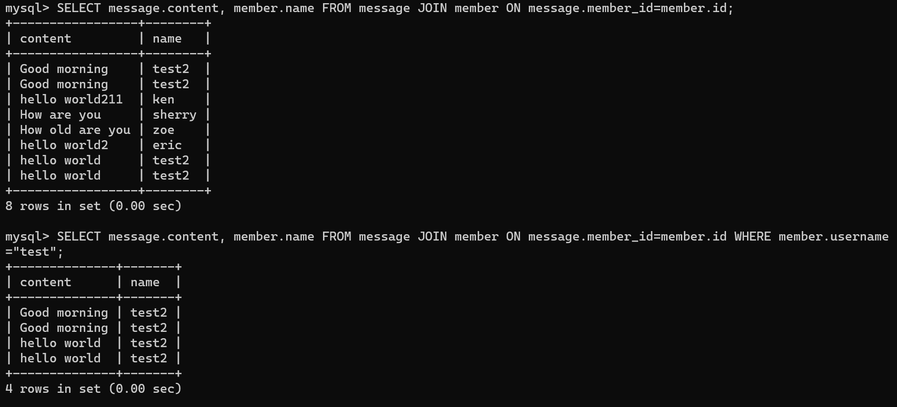
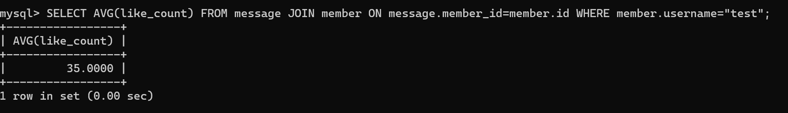

要求三 
● 使⽤ INSERT 指令新增⼀筆資料到 member 資料表中，這筆資料的 username 和
password 欄位必須是 test。接著繼續新增⾄少 4 筆隨意的資料。 
● 使⽤ SELECT 指令取得所有在 member 資料表中的會員資料。
  
要求三 
● 使⽤ SELECT 指令取得所有在 member 資料表中的會員資料，並按照 time 欄位，由
近到遠排序。 
● 使⽤ SELECT 指令取得 member 資料表中第 2 到第 4 筆共三筆資料，並按照 time 欄
位，由近到遠排序。( 並非編號 2、3、4 的資料，⽽是排序後的第 2 ~ 4 筆資料 )
  
要求三 
● 使⽤ SELECT 指令取得欄位 username 是 test 的會員資料。 
● 使⽤ SELECT 指令取得欄位 username 是 test、且欄位 password 也是 test 的資料。 
● 使⽤ UPDATE 指令更新欄位 username 是 test 的會員資料，將資料中的 name 欄位改
成 test2。 
  
   
要求四 
● 取得 member 資料表中，總共有幾筆資料 ( 幾位會員 )。 
● 取得 member 資料表中，所有會員 follower_count 欄位的總和。 
● 取得 member 資料表中，所有會員 follower_count 欄位的平均數。 
  
 要求五 
● 使⽤ SELECT 搭配 JOIN 語法，取得所有留⾔，結果須包含留⾔者的姓名。 
● 使⽤ SELECT 搭配 JOIN 語法，取得 member 資料表中欄位 username 是 test 的所有
留⾔，資料中須包含留⾔者的姓名。 
  
要求五 
● 使⽤ SELECT、SQL Aggregate Functions 搭配 JOIN 語法，取得 member 資料表中
欄位 username 是 test 的所有留⾔平均按讚數。
  

